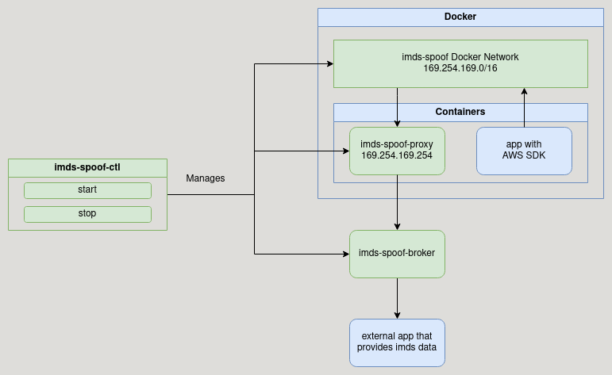

# imds-spoof

## Overview

`imds-spoof` is an application designed to mimic the behavior of the AWS Instance Metadata Service (IMDS) for developers during local development. This application consists of several components working together to provide a local instance metadata service to Docker containers running on developer machines.

The first component is the `imds-spoof Docker network`. This network is set up with the 169.254.169.0/16 CIDR range to mimic the IP range used by AWS instances for their metadata service.

The second component is an Nginx proxy Docker container named `imds-spoof-proxy`. This container is connected to the imds-spoof Docker network and receives IMDS requests from the developer's application container. The proxy then forwards these requests to a "broker" web server running on the Docker host.

The third component is the broker web server, named `imds-spoof-broker`. This server receives proxied traffic from the imds-spoof-proxy and calls an external program to retrieve the necessary IMDS data, which is then returned to the developer's app container. The broker allows imds-spoof to interact with applications on the Docker host.

The fourth component is the `imds-spoof-ctl` CLI. This component allows developers to start and stop the previous three components easily.

The final component is an application that can return IMDS data based on CLI parameters sent to it from the imds-spoof-broker.

imds-spoof provides a local instance metadata service that can be used for testing and development purposes. By mimicking the behavior of the AWS IMDS, developers can test their applications' interactions with the IMDS without needing to deploy to AWS.

## Development status

Working:
- `imds-spoof-ctl`
- `imds-spoof` Docker network
- `imds-spoof-proxy`
- `imds-spoof-broker`

Still working on:
- external app that provides imds data

# Install

tbd

# License

This project is licensed under the Apache License, Version 2.0. See the LICENSE file for more information.